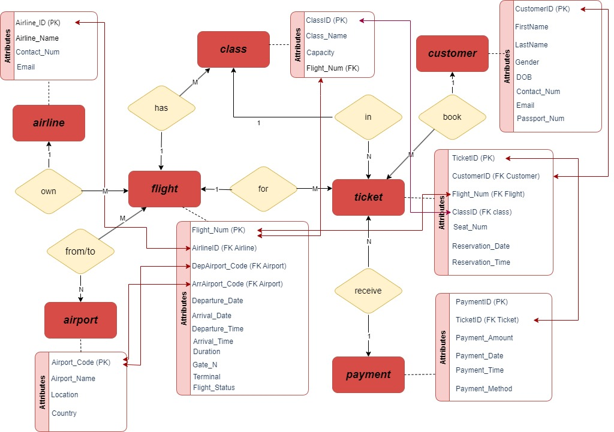

# Flight Ticket Reservation Database

## Overview

The Flight Ticket Reservation Database is designed to manage flight ticket reservations efficiently. It includes entities such as customer information, airlines, airports, ticket details, flight details, payments, and flight classes. These entities and their relationships ensure smooth functionality for booking and managing flight reservations where it hosts in MySQL relational database.
---

---
## SQL Queries

Here are some example questions to demonstrate the interact with the database with SQL queries:
1. What are some payment information of John Doe such as the amount he spent, payment date, payment time and payment method?
2. What is the flight information in June 2023?
3. How many available ticket in Business class of Flight 106?
4. What are all the passenger information on flight number 106?
5. Update the necessary information about flight 103 such as Flight Status and Time due to 30 minutes delay.
6. What are all the code which represents airport or airline?
7. Which flight has economy price ticket higher than business class from other flight ?
8. What is the total revenue generated from Flight 104?
9. Delete the information about Flight 101, and the other information that refers to it.

